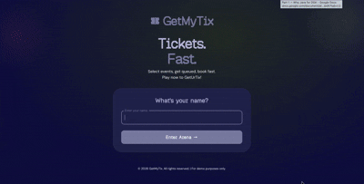
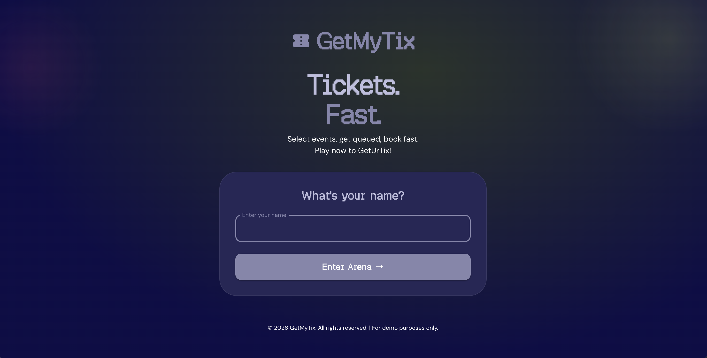
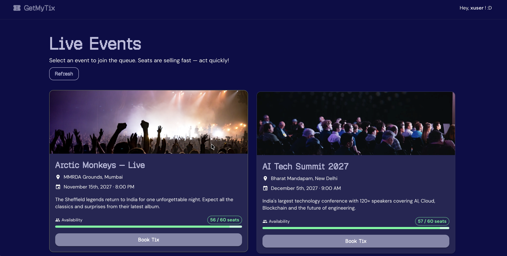
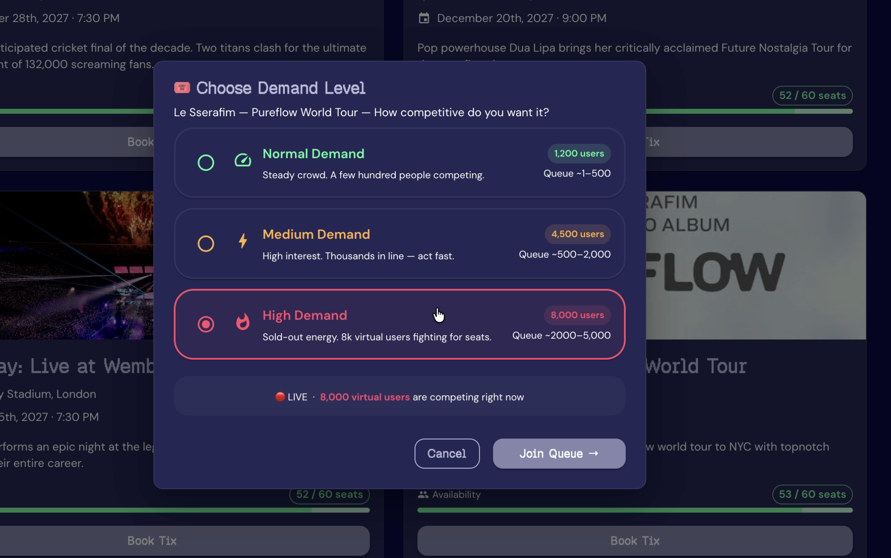
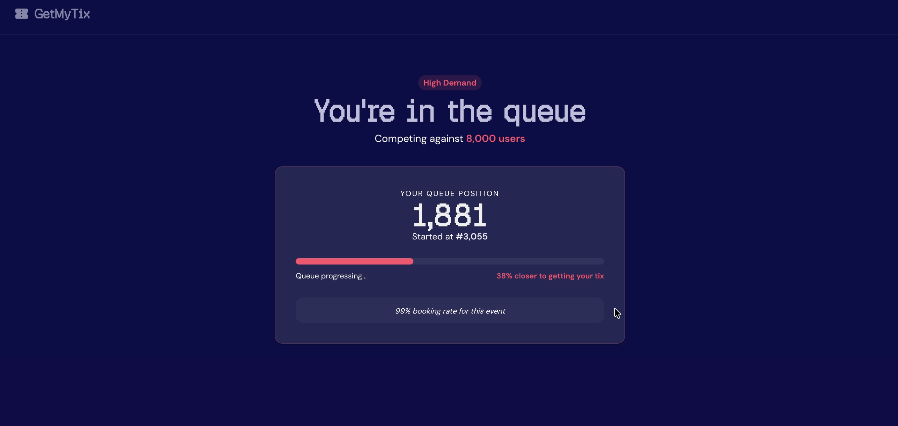
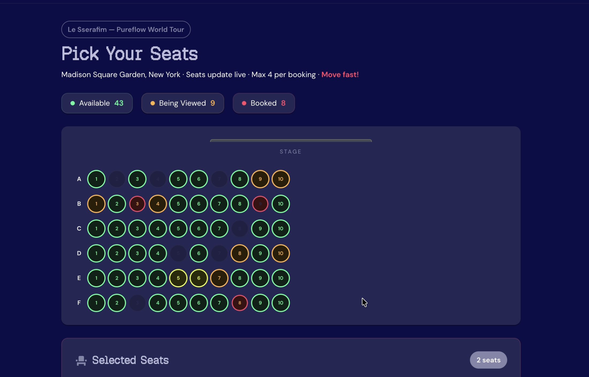
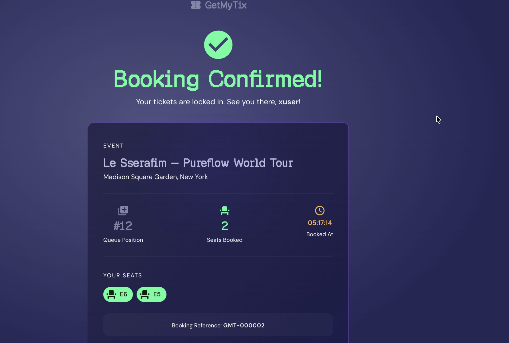

# 🎟️ GetMyTix

> **A full-stack ticket booking simulation built with Spring Boot, React, and PostgreSQL to demonstrate how real-world booking systems handle concurrent users, optimistic locking, race conditions, and high-demand ticket sales.**

Unlike a traditional CRUD application, **GetMyTix** focuses on the engineering challenges behind ticket booking systems—preventing double bookings, handling simultaneous seat requests, and managing user queues under heavy traffic.

---

## 🎥 Demo



---

## 📸 Screenshots

### Landing Page



### Events



###Demand



### Queue



### Seat Selection



### Booking Success



---

# ✨ Features

* 🎫 Interactive ticket booking workflow
* 🚦 Simulated virtual waiting queue
* 🪑 Live seat map with real-time availability
* 🔄 Safe concurrent booking conflict handling
* 🤖 Background scheduler simulating booking traffic
* 📊 Dynamic seat state updates
* 🎨 Responsive Material UI interface
* 🧩 Modular backend architecture

---

# 🚀 Demo Flow

This application is a **simulation**, so **no signup, email verification, or real payment information is required.**

1. Enter any username
2. Select an event
3. Choose a demand level (Low / Medium / High)
4. Join the virtual queue
5. Wait until admitted
6. Select available seats
7. Enter any placeholder card details
8. Complete the booking

If another user books your selected seat before checkout, the booking is rejected gracefully and you're prompted to retry.

---

# 🛠 Tech Stack

| Layer       | Technology                           |
| ----------- | ------------------------------------ |
| Frontend    | React 18, Vite, Material UI, Zustand |
| Backend     | Spring Boot 3, Spring Data JPA       |
| Database    | PostgreSQL                           |
| Build Tools | Maven, Node.js                       |

---

# 🏗️ Project Structure

```text
getmytix/
├── backend/
│   ├── controller/
│   ├── service/
│   ├── repository/
│   ├── entity/
│   ├── scheduler/
│   ├── dto/
│   └── config/
│
└── frontend/
    ├── pages/
    ├── api/
    ├── store/
    └── theme/
```

---

# ⚙️ Local Setup

## Prerequisites

* Java 21+
* Node.js 18+
* PostgreSQL 14+

---

## 1. Create the database

```bash
psql -U postgres -c "CREATE DATABASE getmytix;"
```

Flyway will automatically apply all database migrations when the backend starts.

---

## 2. Start the backend

```bash
cd backend
./mvnw spring-boot:run
```

Runs on:

```
http://localhost:8080
```

---

## 3. Start the frontend

```bash
cd frontend
npm install
npm run dev
```

Runs on:

```
http://localhost:5173
```

---

# 🔒 Concurrency with Optimistic Locking

The core purpose of this project is demonstrating **safe concurrent bookings** using JPA's optimistic locking.

Each seat maintains a version number.

```java
@Version
@Column(nullable = false)
private Long version;
```

When two users attempt to reserve the same seat simultaneously:

```
User A reads Seat 15 (Version 3)
User B reads Seat 15 (Version 3)

↓

User A successfully books

↓

Seat Version becomes 4

↓

User B attempts booking

↓

Version mismatch detected

↓

409 CONFLICT returned
```

Instead of locking database rows while users browse seats, the application validates the seat version only when the booking is submitted. This allows much higher throughput under concurrent traffic while preventing duplicate bookings.

---

# 🤖 Background Booking Simulator

To mimic real ticket-sale traffic, a scheduler continuously performs automated seat operations.

| Task                  | Frequency        |
| --------------------- | ---------------- |
| Lock random seats     | Every 4 seconds  |
| Book locked seats     | Every 7 seconds  |
| Release expired locks | Every 10 seconds |

This creates a constantly changing seat map where seats transition between different states in real time.

---

# 🎯 Seat Lifecycle

```text
AVAILABLE
    │
    ▼
LOCKED
    │
    ▼
BOOKED

Expired Lock
     ▲
     └──────────────
```

| State        | Description                         |
| ------------ | ----------------------------------- |
| 🟢 AVAILABLE | Ready to book                       |
| 🟠 LOCKED    | Temporarily reserved during booking |
| 🔵 BOOKED    | Successfully purchased              |

---

# 🌐 API Overview

## Events

```http
GET /api/events
GET /api/events/{id}
```

## Seats

```http
GET /api/events/{id}/seats
```

## Queue

```http
POST /api/queue/join
GET  /api/queue/{id}/status
POST /api/queue/{id}/admit
```

## Booking

```http
POST /api/bookings
```

Example request:

```json
{
  "eventId": 1,
  "userName": "Alice",
  "queueEntryId": 42,
  "seats": [
    {
      "seatId": 15,
      "version": 3
    }
  ]
}
```

Possible responses

| Status          | Meaning                             |
| --------------- | ----------------------------------- |
| 200 OK          | Booking successful                  |
| 409 Conflict    | Seat already booked by another user |
| 400 Bad Request | Validation failed                   |

---

# ⚖️ Engineering Decisions

| Decision         | Choice                          | Why?                                                    |
| ---------------- | ------------------------------- | ------------------------------------------------------- |
| Locking Strategy | Optimistic Locking (`@Version`) | High throughput without long-lived database locks       |
| Queue Storage    | PostgreSQL                      | Simple and sufficient for an MVP                        |
| State Management | Zustand                         | Lightweight with minimal boilerplate                    |
| Architecture     | Modular Monolith                | Easier to develop, maintain, and extend                 |
| Authentication   | None                            | Kept intentionally out of scope to focus on concurrency |

---

# 🚀 Future Improvements

* Redis-backed queue system
* JWT/OAuth authentication
* Real payment gateway integration
* WebSocket-based live queue updates
* Docker & Docker Compose support
* Load testing using JMeter or Gatling
* Admin dashboard for event management
* Email confirmations
* Booking history

---

# 📚 What This Project Demonstrates

* Designing a scalable booking workflow
* Preventing race conditions
* Optimistic concurrency control
* Spring Boot REST API development
* React state management with Zustand
* Database versioning using JPA
* Clean modular architecture
* Full-stack application development

---

## 👩‍💻 Author

**Jagriti Tripathi**

If you found this project interesting, feel free to ⭐ the repository!
